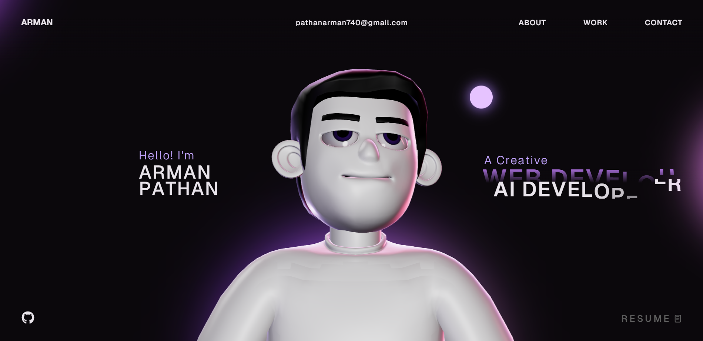

# 🚀 Arman's Portfolio Website

A modern, interactive personal portfolio website built to showcase my projects, skills, experience, and creative work.

The website focuses on smooth animations, interactive 3D elements, and a clean modern interface.

## 🌐 Live Website

**Portfolio:** [Add your Vercel URL here]

## ✨ Features

* 🎨 Modern and responsive UI
* ⚡ Smooth GSAP animations
* 🖱️ Interactive scroll-based effects
* 🌌 3D/WebGL elements
* 📱 Fully responsive design
* 💼 Projects and work showcase
* 🧑‍💻 Skills and technology section
* 📬 Contact section
* 🚀 Optimized for production deployment

## 🛠️ Tech Stack

* **React**
* **TypeScript**
* **JavaScript**
* **HTML5**
* **CSS3**
* **GSAP**
* **ScrollTrigger**
* **ScrollSmoother**
* **Three.js**
* **WebGL**
* **Vite**

## 📂 Project Structure

```text
Portfolio-Website/
├── public/
├── src/
│   ├── components/
│   ├── assets/
│   ├── utils/
│   ├── App.tsx
│   └── main.tsx
├── index.html
├── package.json
├── vite.config.ts
└── README.md
```

## 🚀 Getting Started

### 1. Clone the repository

```bash
git clone https://github.com/ArmanPathan23/my-portfolio-website.git
```

### 2. Navigate to the project

```bash
cd my-portfolio-website
```

### 3. Install dependencies

```bash
npm install
```

### 4. Start the development server

```bash
npm run dev
```

The development server will start locally.

### 5. Create a production build

```bash
npm run build
```

### 6. Preview the production build

```bash
npm run preview
```

## 🎯 Purpose

This portfolio was created to showcase my development journey, technical skills, projects, and experience while experimenting with modern web technologies and interactive web experiences.

## 👨‍💻 About Me

I'm **Arman Pathan**, a B.Tech student specializing in **Artificial Intelligence and Machine Learning**, with an interest in web development, AI, creative technology, and building interactive digital experiences.

I'm continuously learning and experimenting with new technologies to improve my development skills and build better projects.

## 📌 Projects

Some of the projects showcased in this portfolio include:

* 🔐 Password Analyzer
* 🛡️ URL Detection / Security Projects
* 🤖 AI-based projects
* 🌐 Web development projects
* 📊 Data Science and Machine Learning projects
* 🎨 Interactive frontend experiments

More projects are available on my portfolio website.

## 📸 Preview



> Replace `./public/preview.png` with your actual portfolio screenshot if you want to display one here.

## 📄 License

This project is my personal portfolio project.

The source code is available for **learning and reference purposes**. Please do not copy the complete website, design, branding, personal content, or assets and present them as your own work.

If you use portions of the code for learning, experimentation, or your own project, please provide appropriate attribution.

## ⭐ Feedback

If you find something interesting in this project or have suggestions for improvement, feel free to open an issue or connect with me.

---

### Built with ❤️ by Arman Pathan
